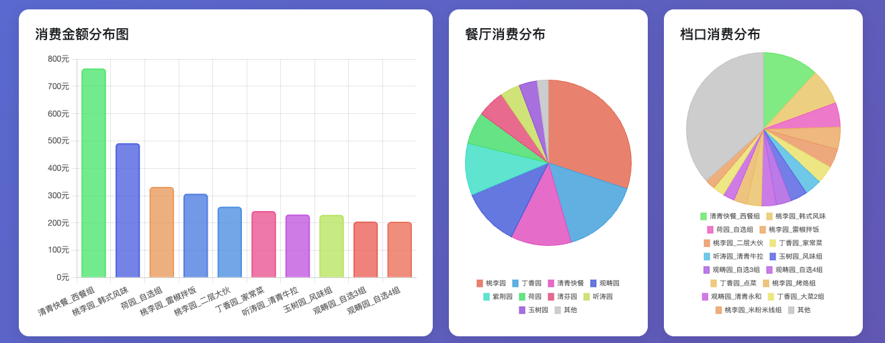
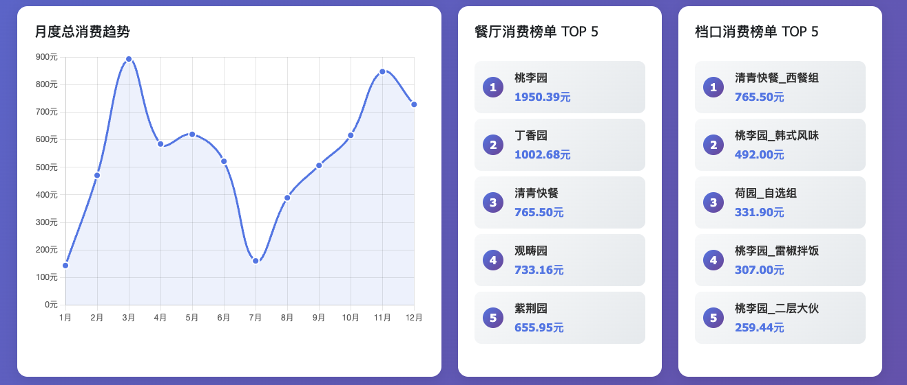
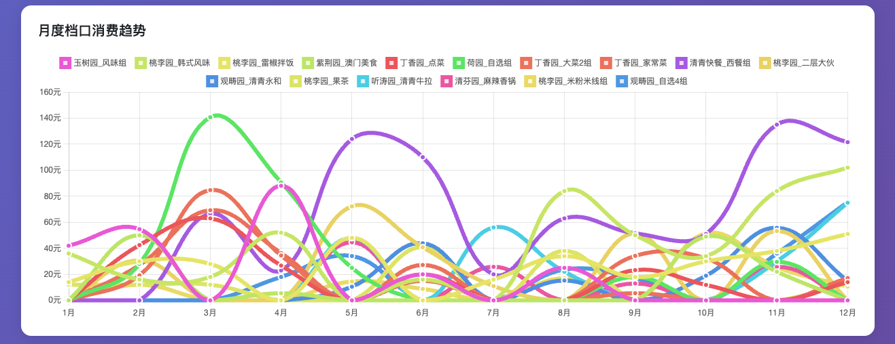

# 🍽️ 清华大学食堂消费分析工具

**一年过去了，你在清华食堂里花的钱都花在哪儿了？** 📊

这是一个专为清华大学学生设计的食堂消费数据分析工具，通过校园卡数据，帮你深入了解自己的餐饮消费习惯和偏好。

## ✨ 项目特色

### 🎨 智能颜色系统设计
- **餐厅色彩编码**：相同餐厅自动分配相近色系，直观识别
- **档口渐变区分**：同一餐厅下不同档口采用颜色渐变，便于区分
- **视觉一致性**：精心设计的配色方案，确保图表美观易读
- **品牌识别**：每个餐厅都有独特的视觉标识

### 📊 多维度数据分析
- **消费总览**：总消费金额、商家数量、平均消费等核心指标
- **时间趋势**：月度消费变化趋势，发现消费规律
- **餐厅排行**：TOP5餐厅和档口排行榜，找出你的最爱
- **详细记录**：完整的消费明细，支持搜索和排序

### 📈 丰富的可视化图表
- **柱状图**：展示TOP10商家消费金额分布
- **饼图分析**：餐厅和档口消费占比分析
- **趋势折线图**：月度总消费和TOP3档口消费趋势
- **排行榜**：可视化展示餐厅和档口消费排名

## 🚀 新版网页版上线！

现在提供了**现代化网页版**，拥有更美观的界面和更强大的功能！

### 📱 网页版特点
- 🎨 **现代化界面**：采用响应式设计，支持手机、平板、电脑
- 📊 **数据可视化**：Chart.js图表展示消费分布
- 🔍 **智能表格**：DataTables支持搜索、排序、分页
- 💾 **本地存储**：保存配置，下次自动填充
- 📅 **灵活查询**：自定义日期范围

### 🚀 快速开始（网页版）

#### 1. 安装依赖
```bash
pip install -r requirements.txt
```

#### 2. 启动服务
```bash
python run.py
# 或直接运行：uvicorn app:app --reload
```

#### 3. 打开浏览器访问
http://localhost:8000

## 🖥️ 传统命令行版本

### 项目简介

> 项目的 idea 来源于 [Rose-max111](https://github.com/Rose-max111)。

本项目是一个用于统计华清大学学生在食堂（和宿舍）的消费情况的脚本。通过模拟登录华清大学校园卡网站，获取学生在华子食堂的消费记录，并通过数据可视化的方式展示。








### 使用方法（命令行版）

#### 0. 获取服务代码

首先，登录校园卡账号后，在[华清大学校园卡网站](https://card.tsinghua.edu.cn/userselftrade)获取你的服务代码。


`F12` 打开开发者工具，切换到 Network（网络）标签页，然后 `Ctrl + R` 刷新页面，找到 `userselftrade` 这个请求，查看标头中的 `Cookie` 字段，其中包含了你的服务代码。

服务代码是 `servicehall=` **之后**的一串字符（不含 `servicehall=`），复制下来，后面会用到。


#### 1. 安装依赖

本项目依赖于 `requests`、`matplotlib` 和 `pycryptodome`，请确保你的 Python 环境中已经安装了这些库。

```bash
pip install requests matplotlib pycryptodome
```

> 你可能需要在 `Python\Python312\Lib\site-packages` 目录下将 `crypto` 文件夹改名为 `Crypto`。

#### 2. 运行脚本

```bash
python main.py
```

首次运行时，请输入你的学号和服务代码，会自动保存在 `config.json` 文件中。

#### 3.（可选）修改配置

如果你想修改学号或者服务代码，可以直接修改 `config.json` 文件。

```json
{
    "idserial": "你的学号",
    "servicehall": "你的服务代码"
}
```

## 📊 数据表格详细说明

### 核心数据表格
1. **消费统计表**
   - 排名：消费金额从高到低排序
   - 商家名称：完整的餐厅_档口名称
   - 消费金额：精确到分的实际消费金额
   - 占比：该商家占总消费的百分比，带进度条可视化
   - 操作：查看商家详细信息

2. **月度趋势表**
   - 按月份汇总消费数据
   - 每月TOP3档口详细消费金额
   - 月度总消费对比

### 图表数据展示
- **餐厅消费分布图**：合并相同餐厅的饼图展示
- **档口消费分布图**：保持独立档口的详细分析
- **月度消费趋势**：12个月的消费变化折线图
- **TOP3档口月度趋势**：追踪最爱档口的月度变化

### 排行榜功能
- **餐厅排行榜**：TOP5餐厅消费排名
- **档口排行榜**：TOP5档口消费排名
- **实时更新**：数据加载后自动计算排序

## 🎨 颜色设计原理

### 智能配色系统
我们的颜色系统基于以下原则设计：

1. **餐厅识别**：每个主餐厅分配独特的HSL色彩空间
2. **渐变区分**：相同餐厅下的档口使用色相偏移±20度的渐变
3. **饱和度控制**：保持70%饱和度确保色彩鲜明但不刺眼
4. **亮度平衡**：60%亮度确保在不同背景下都有良好可读性

### 色彩映射示例
- **紫荆园**：蓝色系 (HSL: 210°, 70%, 60%)
  - 紫荆园一层：210° ± 0°
  - 紫荆园二层：210° ± 10°
  - 紫荆园三层：210° ± 20°

- **桃李园**：绿色系 (HSL: 120°, 70%, 60%)
  - 桃李园一层：120° ± 0°
  - 桃李园二层：120° ± 10°

## 📁 项目结构

```
THU-Annual-Eat/
├── app.py              # 网页版FastAPI主应用
├── run.py              # 网页版启动脚本
├── requirements.txt    # Python依赖列表
├── templates/
│   └── index.html      # 响应式前端页面
├── static/
│   ├── app.js          # 前端交互逻辑
│   └── style.css       # 样式文件（预留）
├── main.py             # 传统命令行版本
├── README.md           # 项目文档
└── demo.png            # 项目演示图
```

## 🚀 获取和运行项目

### 📥 获取项目

```bash
git clone https://github.com/ZaytsevZY/THU-Annual-Eat.git
cd THU-Annual-Eat
```

### 🔧 运行网页版（推荐）

#### 1. 安装依赖
```bash
pip install -r requirements.txt
```

#### 2. 启动服务
```bash
python run.py
```

#### 3. 访问应用
打开浏览器访问：http://localhost:8000

### 💻 运行命令行版

#### 1. 安装依赖
```bash
pip install requests matplotlib pycryptodome
```

#### 2. 运行脚本
```bash
python main.py
```

### 📋 使用步骤

1. **获取服务代码**：登录[清华大学校园卡网站](https://card.tsinghua.edu.cn)，按README中步骤获取servicehall值
2. **输入学号和服务代码**：在网页表单中填写你的学号和服务代码
3. **选择时间范围**：可自定义查询的起止日期
4. **开始分析**：点击按钮获取完整的消费分析报告

### 🔗 相关链接

- **项目主页**：[GitHub - THU-Annual-Eat](https://github.com/ZaytsevZY/THU-Annual-Eat)
- **问题反馈**：[Issues](https://github.com/ZaytsevZY/THU-Annual-Eat/issues)
- **版本更新**：[Releases](https://github.com/ZaytsevZY/THU-Annual-Eat/releases)

## 🤝 贡献指南

欢迎提交Issue和Pull Request来帮助改进这个项目！

### 开发环境
- Python 3.8+
- FastAPI + Jinja2 + Bootstrap 5
- Chart.js 数据可视化
- DataTables 表格增强

## 📄 许可证

除非另有说明，本仓库的内容采用 [CC BY-NC-SA 4.0](https://creativecommons.org/licenses/by-nc-sa/4.0/) 许可协议。

## 🙋‍♂️ 联系我们

如有问题或建议，欢迎通过以下方式联系：
- GitHub Issues：[提交问题](https://github.com/ZaytsevZY/THU-Annual-Eat/issues/new)
- 项目维护者：[@ZaytsevZY](https://github.com/ZaytsevZY)

---

**⭐ 如果这个项目对你有帮助，请给个Star支持一下！**
